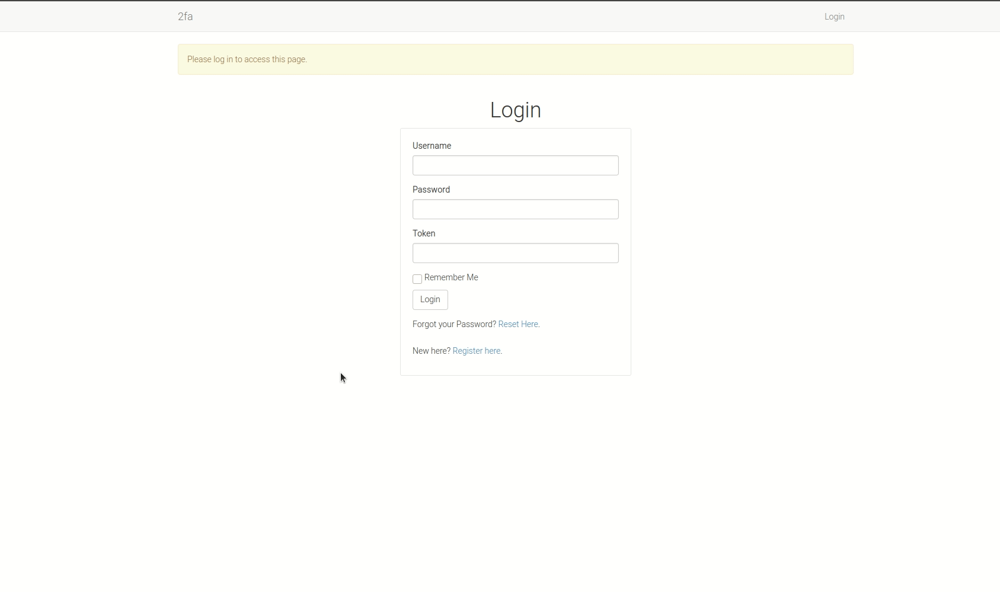

# Time-based One Time Password Authentication in Flask



To provide for an extra layer of security to your users, you can provide a time-based two-factor authentication. In this application, I have implemented:

* Flask login
* TOTP

### What exactly is TOTP?

The idea behind one-time passwords is that they are valid for only one login session. The passwords are generated using an algorithm by a smartphone app whose token changes at a predefined time interval, usually every 30 seconds.

### Features

1. Basic user authentication using passwords
2. Mandatory use of 2fa for successful authentication

### Tools Used

1. Flask web framework
2. Pythhon for programming
3. Flask bootstrap for cross-browser responsives
4. Ngrok for localhost testing
5. Google fonts
6. Flask sqlalchemy for database management
7. Flask mail for password resets
8. Flask WTF for secure creation of web forms
9. Flask login to handle user login sessions
10. Python dotenv to load environment variables
11. PyQRCode to work with QRCodes
12. Python JWT to work with password reset tokens
13. Gunicorn and pyscopg2 for heroku deployment

### Contributors

* [Gitau Harrison](https://github.com/GitauHarrison)

### Deployed Application

* [Simple 2fa App](https://simple-2fa.herokuapp.com/login?next=%2Fhome)

### Requirements

Before you can successfully test this app, you will need to have these:

* A smartphone
* Access to Google PlayStore or Apple AppStore

Search for and install freeOTP apps such as:

1. [Google Authenticator](https://play.google.com/store/apps/details?id=com.google.android.apps.authenticator2&hl=en_US&gl=US)
2. [FreeOTP Authenticator](https://play.google.com/store/apps/details?id=org.fedorahosted.freeotp&hl=en_US&gl=US)
### Testing

I have used `ngrok` for temporary provision of free public URLs which redirect to the application. Follow the steps below to test this application:

1. Clone this repo:

```python
$ git@github.com:GitauHarrison/how-to-implement-time-based-two-factor-auth-in-flask.git
```

2. Create and activate your virtual environment:

```python
$ mkvirtualenv flask_2fa
```

3. Install dependencies used:

```python
(flask_2fa)$ pip3 install -r requirements.txt
```

4. Run flask server:

```python
(flask_2fa)$ flask run
```

Once your application is running, you can access your localhost on http://127.0.0.1:5000/. Additionally, if you look carefully in your terminal, you will see: `* Tunnel URL: NgrokTunnel: "http://4209c9af6d43.ngrok.io" -> "http://localhost:5000"`

The HTTP value may be different from the one shown here because I am using the free tier package of ngrok. Paste the link http://4209c9af6d43.ngrok.io on another device, say your mobile phone, to test the application while it is on localhost.

Another way to obtain `ngrok`'s free public URLs would be to run the command below in a new terminal window:

```python
(flask_2fa)$ ngrok http 5000

# Output

ngrok by @inconshreveable                               (Ctrl+C to quit)
                                                                        
Session Status                online                                    
Session Expires               1 hour, 58 minutes                        
Version                       2.3.35                                    
Region                        United States (us)                        
Web Interface                 http://127.0.0.1:4042                     
Forwarding                    http://6e95e59c2233.ngrok.io -> http://loc
Forwarding                    https://6e95e59c2233.ngrok.io -> http://lo
                                                                        
Connections                   ttl     opn     rt1     rt5     p50     p9
                              0       0       0.00    0.00    0.00    0.
```

Note the lines beginning with 'Forwarding'. These show the public URLs that ngrok uses to redirect requests into our service. This method provides you with `https://`.

With the application up and running, click on:

* Register link
* Register a user (such as user1 by providing all needed details)
* Open the FreeOTP app in your smartphone
* Click on Scan QRCode
* Scan this app's QRCode (which comes after registering a user). Note the Code in the scanner app. 
* Click Login
* Enter that code in the _Token_ field
* Click Login again (you will now be logged in)

### Reference

1. If you are new to flask, start [here](https://gitauharrison-blog.herokuapp.com/personal-blog).
2. If you do not know what the command `mkvirtualenv` is, learn more [here](https://gitauharrison-blog.herokuapp.com/virtualenvwrapper).
3. If you would prefer to understand more how I created this project, get the guide [here](https://github.com/GitauHarrison/notes/blob/master/2fa_flask.md).